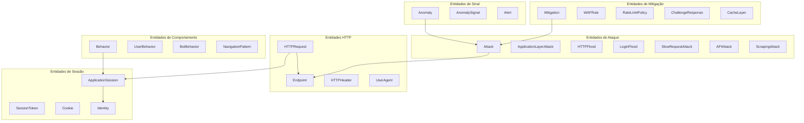
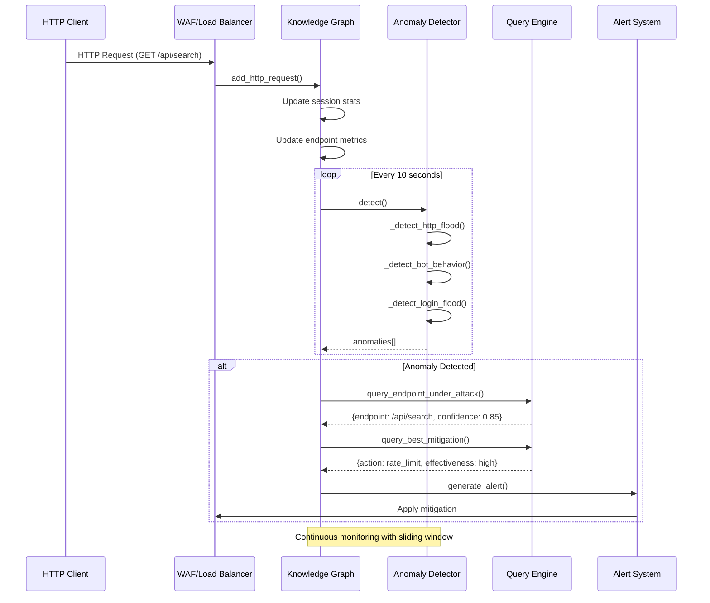
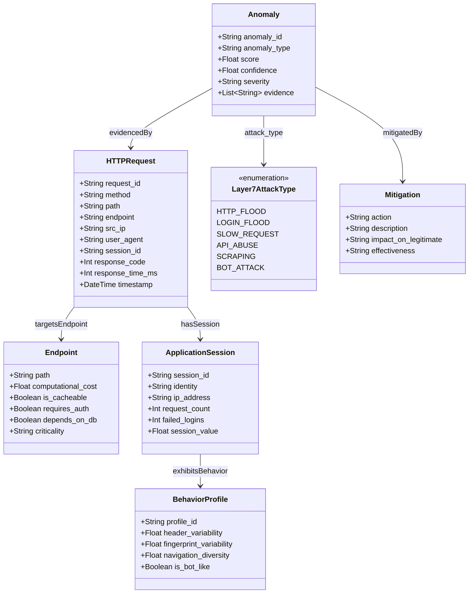
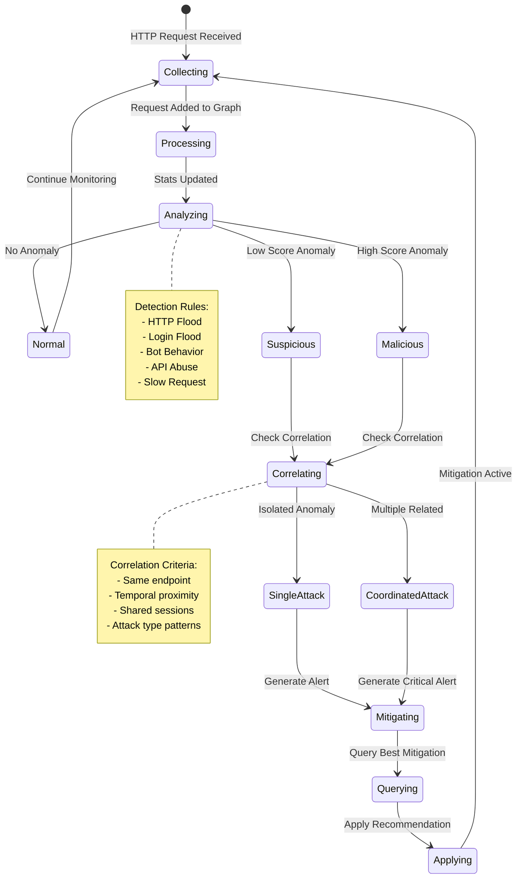
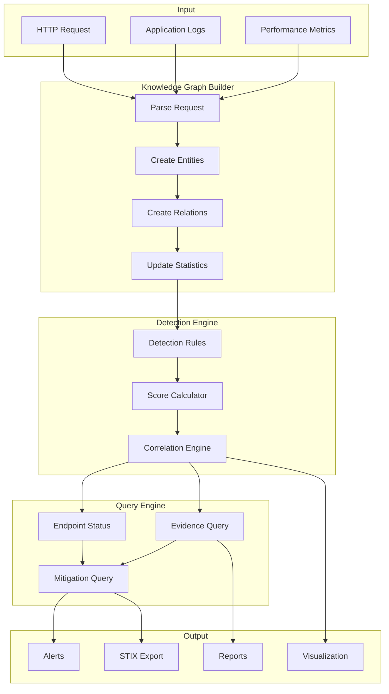
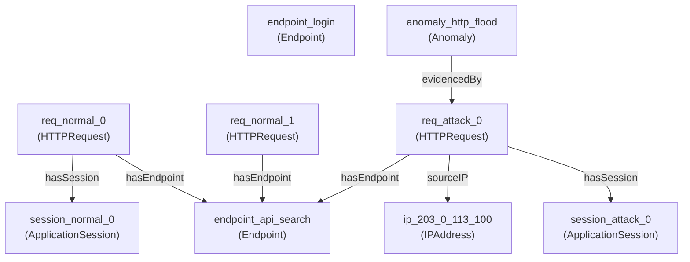

# Knowledge Graph para Detecção de DDoS de Camada 7

## Diagrama Completo do Grafo de Conhecimento

Este documento apresenta um exemplo completo do grafo de conhecimento para detecção de ataques DDoS de camada 7, usando a sintaxe Mermaid.

---

## 1. Visão Geral da Ontologia



---

## 2. Grafo de Conhecimento Completo - Cenário de Ataque

Este diagrama mostra um cenário completo de ataque DDoS de camada 7 com todas as entidades e relacionamentos:

```mermaid
graph TB
    %% Definição de estilos
    classDef request fill:#4CAF50,stroke:#2E7D32,color:white
    classDef endpoint fill:#2196F3,stroke:#1565C0,color:white
    classDef session fill:#FF9800,stroke:#E65100,color:white
    classDef attack fill:#F44336,stroke:#C62828,color:white
    classDef anomaly fill:#9C27B0,stroke:#6A1B9A,color:white
    classDef behavior fill:#00BCD4,stroke:#00838F,color:white
    classDef mitigation fill:#8BC34A,stroke:#558B2F,color:white
    classDef ip fill:#607D8B,stroke:#37474F,color:white
    
    %% IPs de origem
    IP1[IP: 203.0.113.100]:::ip
    IP2[IP: 203.0.113.101]:::ip
    IP3[IP: 198.51.100.50]:::ip
    IP4[IP: 192.168.1.10]:::ip
    
    %% Endpoints da aplicação
    EP_LOGIN[/login<br/>cost: 0.8<br/>criticality: high]:::endpoint
    EP_SEARCH[/api/search<br/>cost: 0.9<br/>criticality: high]:::endpoint
    EP_PRODUCTS[/api/products<br/>cost: 0.6<br/>criticality: medium]:::endpoint
    EP_CHECKOUT[/checkout<br/>cost: 0.95<br/>criticality: critical]:::endpoint
    EP_GRAPHQL[/api/graphql<br/>cost: 0.85<br/>criticality: high]:::endpoint
    
    %% Sessões de ataque
    SESS_ATK1[Attack Session 1<br/>requests: 150<br/>failed_logins: 0]:::session
    SESS_ATK2[Attack Session 2<br/>requests: 200<br/>failed_logins: 0]:::session
    SESS_LOGIN[Login Attack Session<br/>requests: 50<br/>failed_logins: 50]:::session
    SESS_NORMAL[Normal Session<br/>requests: 10<br/>failed_logins: 0]:::session
    
    %% Requisições HTTP
    REQ1[HTTP Request 1<br/>GET /api/search<br/>response: 200]:::request
    REQ2[HTTP Request 2<br/>GET /api/search<br/>response: 200]:::request
    REQ3[HTTP Request 3<br/>POST /login<br/>response: 401]:::request
    REQ4[HTTP Request 4<br/>GET /api/products<br/>response: 200]:::request
    REQ5[HTTP Request 5<br/>POST /api/graphql<br/>response: 400]:::request
    
    %% Perfis de comportamento
    BEH_BOT1[Bot Behavior 1<br/>header_var: 0.05<br/>nav_div: 0.1]:::behavior
    BEH_BOT2[Bot Behavior 2<br/>header_var: 0.02<br/>nav_div: 0.05]:::behavior
    BEH_USER[User Behavior<br/>header_var: 0.8<br/>nav_div: 0.7]:::behavior
    
    %% Anomalias detectadas
    ANOM_HTTP[Anomaly: HTTP Flood<br/>score: 0.85<br/>severity: high]:::anomaly
    ANOM_LOGIN[Anomaly: Login Flood<br/>score: 0.92<br/>severity: critical]:::anomaly
    ANOM_BOT[Anomaly: Bot Behavior<br/>score: 0.78<br/>severity: medium]:::anomaly
    ANOM_API[Anomaly: API Abuse<br/>score: 0.70<br/>severity: medium]:::anomaly
    
    %% Ataques identificados
    ATTACK_HTTP[HTTP Flood Attack<br/>type: ApplicationLayerAttack]:::attack
    ATTACK_LOGIN[Login Flood Attack<br/>type: BruteForce]:::attack
    ATTACK_COORD[Coordinated Attack<br/>multi-vector]:::attack
    
    %% Mitigações recomendadas
    MITIG_RATE[Rate Limit Policy<br/>100 req/min]:::mitigation
    MITIG_CAPTCHA[CAPTCHA Challenge<br/>login endpoint]:::mitigation
    MITIG_CACHE[CDN Caching<br/>static content]:::mitigation
    MITIG_WAF[WAF Rule<br/>block suspicious UA]:::mitigation
    
    %% Relacionamentos - Requisições para IPs
    REQ1 -->|sourceIP| IP1
    REQ2 -->|sourceIP| IP2
    REQ3 -->|sourceIP| IP3
    REQ4 -->|sourceIP| IP4
    REQ5 -->|sourceIP| IP1
    
    %% Relacionamentos - Requisições para Endpoints
    REQ1 -->|targetsEndpoint| EP_SEARCH
    REQ2 -->|targetsEndpoint| EP_SEARCH
    REQ3 -->|targetsEndpoint| EP_LOGIN
    REQ4 -->|targetsEndpoint| EP_PRODUCTS
    REQ5 -->|targetsEndpoint| EP_GRAPHQL
    
    %% Relacionamentos - Requisições para Sessões
    REQ1 -->|hasSession| SESS_ATK1
    REQ2 -->|hasSession| SESS_ATK2
    REQ3 -->|hasSession| SESS_LOGIN
    REQ4 -->|hasSession| SESS_NORMAL
    REQ5 -->|hasSession| SESS_ATK1
    
    %% Relacionamentos - Sessões para Comportamentos
    SESS_ATK1 -->|exhibitsBehavior| BEH_BOT1
    SESS_ATK2 -->|exhibitsBehavior| BEH_BOT2
    SESS_NORMAL -->|exhibitsBehavior| BEH_USER
    
    %% Relacionamentos - Anomalias para Evidências
    ANOM_HTTP -->|evidencedBy| REQ1
    ANOM_HTTP -->|evidencedBy| REQ2
    ANOM_LOGIN -->|evidencedBy| REQ3
    ANOM_BOT -->|evidencedBy| BEH_BOT1
    ANOM_BOT -->|evidencedBy| BEH_BOT2
    ANOM_API -->|evidencedBy| REQ5
    
    %% Relacionamentos - Anomalias para Ataques
    ANOM_HTTP -->|indicates| ATTACK_HTTP
    ANOM_LOGIN -->|indicates| ATTACK_LOGIN
    ANOM_HTTP -->|indicates| ATTACK_COORD
    ANOM_LOGIN -->|indicates| ATTACK_COORD
    
    %% Relacionamentos - Ataques para Endpoints
    ATTACK_HTTP -->|targetsEndpoint| EP_SEARCH
    ATTACK_LOGIN -->|targetsEndpoint| EP_LOGIN
    ATTACK_COORD -->|targetsEndpoint| EP_SEARCH
    ATTACK_COORD -->|targetsEndpoint| EP_LOGIN
    
    %% Relacionamentos - Mitigações
    MITIG_RATE -->|mitigates| ATTACK_HTTP
    MITIG_CAPTCHA -->|mitigates| ATTACK_LOGIN
    MITIG_WAF -->|mitigates| ATTACK_HTTP
    MITIG_CACHE -->|mitigates| EP_PRODUCTS
    
    %% Relacionamentos - Impacto
    ATTACK_HTTP -->|increasesLatency| EP_SEARCH
    ATTACK_HTTP -->|consumesBackendResource| EP_SEARCH
```

---

## 3. Diagrama de Sequência - Detecção em Tempo Real



---

## 4. Diagrama de Classes da Ontologia



---

## 5. Diagrama de Estados - Ciclo de Detecção



---

## 6. Grafo de Correlação de Anomalias

```mermaid
graph LR
    classDef anomaly fill:#F44336,stroke:#C62828,color:white
    classDef endpoint fill:#2196F3,stroke:#1565C0,color:white
    classDef session fill:#FF9800,stroke:#E65100,color:white
    
    A1[Anomaly 1<br/>HTTP Flood<br/>score: 0.85]:::anomaly
    A2[Anomaly 2<br/>HTTP Flood<br/>score: 0.82]:::anomaly
    A3[Anomaly 3<br/>Login Flood<br/>score: 0.92]:::anomaly
    A4[Anomaly 4<br/>Bot Behavior<br/>score: 0.78]:::anomaly
    A5[Anomaly 5<br/>API Abuse<br/>score: 0.70]:::anomaly
    
    EP1[/api/search]:::endpoint
    EP2[/login]:::endpoint
    EP3[/api/graphql]:::endpoint
    
    S1[Session A1]:::session
    S2[Session A2]:::session
    S3[Session Login]:::session
    
    A1 -->|same_endpoint| A2
    A1 -->|same_attack_type| A2
    A2 -->|shared_session| A4
    A3 -->|temporal_proximity| A1
    A5 -->|same_endpoint| A1
    
    A1 -->|targets| EP1
    A2 -->|targets| EP1
    A3 -->|targets| EP2
    A5 -->|targets| EP3
    
    A1 -->|session| S1
    A2 -->|session| S2
    A3 -->|session| S3
    A4 -->|session| S1
    
    style A1 stroke-width:4px
    style A3 stroke-width:4px
```

---

## 7. Fluxo de Dados do Pipeline em Tempo Real



---

## 8. Exemplo de Saída Mermaid do Sistema

Quando você executa `GraphExporter.to_mermaid(kg)`, o sistema gera automaticamente:



---

## Como Usar

### Executar a Simulação Completa

```bash
cd knowledge-graph-ddos-article
pip install networkx numpy
python src/graph_builder/knowledge_graph_ddos.py
```

### Gerar Diagrama Mermaid

```python
from knowledge_graph_ddos import Layer7KnowledgeGraph, GraphExporter

kg = Layer7KnowledgeGraph()
# ... adicionar requisições ...

# Gerar diagrama Mermaid
mermaid_code = GraphExporter.to_mermaid(kg)
print(mermaid_code)

# Salvar em arquivo
with open("graph_diagram.mmd", "w") as f:
    f.write(mermaid_code)
```

### Visualizar Online

1. Copie o código Mermaid gerado
2. Acesse [Mermaid Live Editor](https://mermaid.live/)
3. Cole o código para visualização interativa

---

*Este documento demonstra a estrutura completa do grafo de conhecimento para detecção de DDoS de camada 7.*
